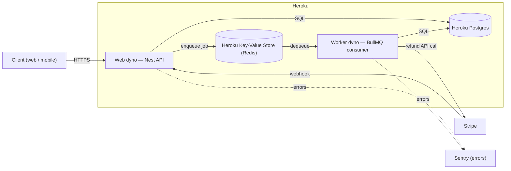

# Architecture

> This is a challenge deliverable (the "Extra Points" one-page write-up: production diagram +
> rationale for the queue decision, the deploy shape, and what to monitor), not an internal
> planning doc. It describes the current **target** architecture and gets edited in place when
> that target changes — the history of why lives in `git log`, not in a changelog section here.
>
> **Current build status:** none of this is deployed. `@nestjs/bullmq` on Redis is installed and
> wired (the Auth module's password-reset and password-changed emails run through it, locally
> via `docker-compose.yml`) — but there is still no `Procfile`, no separate worker process, and
> no deploy target configured. Treat the deploy shape and monitoring sections below as the
> target, not a description of what's running.
>
> Goes stale if the queue technology, the deploy target, or the monitored conditions change.

## Production diagram

## Why there is a queue

Five jobs don't belong inline in a request/response cycle, and one doesn't belong in any HTTP
request at all:

- **Password-reset and password-changed emails** (Auth module, already built). Neither should
  make a signup/signin-adjacent request wait on an email provider's round trip, and a failed send
  must never fail the request that triggered it — `forgot-password` still returns `202` and
  `reset-password` still returns `204` even if the queued email send later fails and retries.
- **Low-stock notification fan-out.** Crossing the threshold (R3) needs to notify some set of
  recipients. Sent inline, a customer's purchase request would pay the latency of every email
  send, and a single failed send would have no business affecting whether the sale itself
  succeeds. Queued as one job per recipient, the sale commits independently and each send
  retries on its own.
- **Refund initiation on order cancellation.** As decided in `business-invariants.md`'s
  interpretation-assumptions table: calling Stripe's refund API synchronously inside the same
  transaction that commits the cancellation is the same dual-write problem R8 avoids for stock —
  if Stripe fails after the commit, or the commit fails after Stripe already refunded, the two
  systems disagree with nothing to reconcile them. Enqueuing the refund after the commit, and
  writing `payments.refunded_at` when it confirms, keeps the two writes separate and each
  retryable on its own.
- **Expired-`PENDING`-order cancellation sweep** (R5). Nothing about a client request naturally
  triggers "go find orders that have been `PENDING` too long" — it has to run on a schedule. This
  job is what releases an expired promo redemption slot.

What breaks without a queue: every one of these becomes a best-effort side effect bolted onto a
request handler — either blocking the primary transaction (or the request) on a concern that
isn't its job, or having no trigger at all (the sweep).

**Not queued:** refresh/reset-token cleanup (`DELETE` of expired and long-revoked rows) is a
plain scheduled task on the worker, not a queued job — there's no per-item retry semantics it
needs.

**Current state:** `@nestjs/bullmq` (BullMQ on Redis) is installed and wired for the two email
jobs above (`src/email/`). The other three jobs (low-stock fan-out, refund initiation, expired-
order sweep) are still only decided, not built — same current-state treatment as CASL in
`coding-style.md`. There is no separate worker process yet; the queue's jobs run in the same
process as the API until the deploy shape below is actually built.

## Deploy shape

**Heroku** — a single web dyno running the Nest API, one worker dyno running the BullMQ
consumer, Heroku Postgres and Heroku Key-Value Store (Redis) as addons. This is the "Extra
Points" deliverable: intended, not yet built — no `Procfile`, no queue dependency, no worker
entrypoint exist in the repo today.

## What to monitor

Three conditions, each backed by a query that already exists or is directly derivable from the
schema:

| Signal                                         | Query                                                                                                                                                                                              | What it means                                                                                              |
| ---------------------------------------------- | -------------------------------------------------------------------------------------------------------------------------------------------------------------------------------------------------- | ---------------------------------------------------------------------------------------------------------- |
| Unprocessed Stripe events past a threshold age | Uses the `stripe_events_unprocessed` partial index (`T-Shirt-constraints.sql`) — rows with `processed_at IS NULL`, ordered by age                                                                  | The webhook handler is failing repeatedly, or Stripe can't reach the endpoint                              |
| Orders that owe a refund                       | `orders.status = 'CANCELLED'` joined to a `payments` row with `status = 'SUCCEEDED'` and `refunded_at IS NULL`                                                                                     | The async refund job (above) is stuck or failed                                                            |
| Duplicate status rows per order                | `SELECT order_id, status, count(*) FROM order_status_history GROUP BY order_id, status HAVING count(*) > 1` — the exact query from `T-Shirt-constraints.sql`'s rejected `UNIQUE(order_id, status)` | A Payment Link's two Stripe events both got handled as a `PAID` transition — expected to be rare, not zero |

Application errors go to Sentry. The three queries above run on a schedule, alerting through
whatever the deploy platform provides — naming a specific alerting product beyond that would be
inventing detail for a project that isn't deployed yet.

The Stripe webhook endpoint's event subscription (configured in the Stripe dashboard, not in this
repo) must include `charge.refunded` alongside `payment_intent.succeeded` and
`checkout.session.completed` — it's what confirms a refund that wasn't immediately `succeeded`
(ACH/bank debit `pending`, or one flagged `requires_action`) once Stripe actually settles it.

`ThrottlerModule` (`src/app.module.ts`) uses `@nestjs/throttler`'s in-memory storage, not the
Redis instance already available for BullMQ. That's correct for the single-web-dyno target above
— rate limits only need to hold per-instance until there's more than one. The moment the web
process scales past one dyno, this needs a Redis-backed throttler storage or rate limits silently
stop being enforced across instances.
